# ⚡ Alastor-Kun

### Estudante de Engenharia da Computação 

<!-- ^ Linha opcional e externa (Vercel). Se preferir zero dependências externas,
     apague este  e deixe só o título e o subtítulo acima. -->

---

## 👾 Sobre mim

- 🎓 Estudante de Engenharia da Computação, com foco em **sempre aprender algo novo**
- 🔧 Trabalho com **C**, **Python** e microcontroladores (**ESP32**)
- 🌌 Interesse em hardware, firmware, redes, cybersecurity, IoT e a fronteira entre software e o mundo físico

---

## 🛠️ Tecnologias

---

## 📊 Estatísticas do GitHub

---

## 🐍 Atividade de contribuições

<picture>
  <source media="(prefers-color-scheme: dark)" srcset="https://raw.githubusercontent.com/Alastor-Kun/Alastor-Kun/output/github-snake-dark.svg" />
  <source media="(prefers-color-scheme: light)" srcset="https://raw.githubusercontent.com/Alastor-Kun/Alastor-Kun/output/github-snake.svg" />
  
</picture>

---

## 🚀 Projetos em destaque

- **[Nome do Projeto 1](https://github.com/Alastor-Kun/repo1)** — Calculador em C para Circuitos I
- **[Nome do Projeto 2](https://github.com/Alastor-Kun/repo2)** — breve descrição do projeto

---

## 📫 Contato

